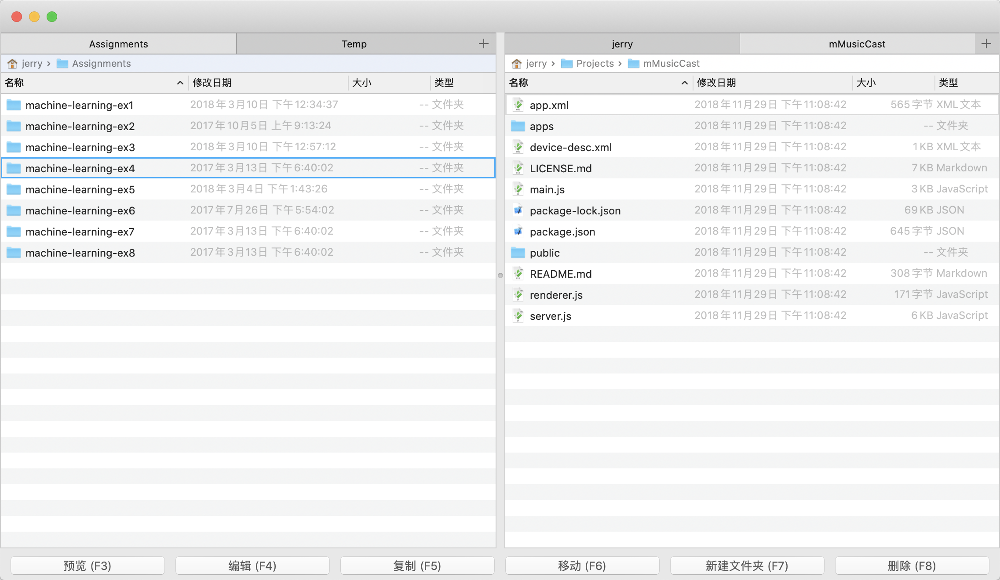

# vCommander

vCommander 是macOS平台下的一个文件管理工具，其双窗口结构借鉴自Total Commander，其许多快捷键借鉴自Vim编辑器，所以我将它命名为vCommander。

vCommander的特点是双窗口、多标签页结构，对键盘操作特别友好，因此提供了许多的快捷键来进行文件管理，如果你是键盘流，你可能会喜欢这个工具。

## 开发工具
* 开发语言： Swift 5
* IDE：Xcode 11.3

## 快捷键

vCommander提供两种快捷键模式，一种是普通模式，主要针对不熟悉Vim快捷键的普通用户，另一种是Vim模式，针对熟悉Vim快捷键的用户。用户可以在偏好设置界面选择自己喜欢的模式。

### 普通模式快捷键：

#### 窗口操作

**Tab**：在左右窗口间切换

#### 文件操作

**⌘-O 或 Enter 或 右方向键**：打开当前光标所在的文件夹

**Backspace 或 左方向键**：返回上一层文件夹

**上方向键**：将焦点移动到上一个文件

**下方向键**：将焦点移动到下一个文件

**空格键**：选中当前光标所在文件（支持多选）

**⌘-Enter**：在访达中显示当前文件或文件夹

**⌘-I**：显示当前文件或文件夹的详细信息

**F2**：重命名当前选中文件

**F3**：预览当前选中文件

**F4**：编辑当前选中文件（可在偏好设置-工具标签页指定你的常用编辑器）

**F5**：复制当前选中文件至对面的窗口

**F6**：移动当前选中文件至对面的窗口

**F7**：新建文件夹

**⇧-F7**：新建文件

**F8**：删除当前选中文件

#### 标签管理

**⌘-T**：新建标签页

**⌘-W**：关闭标签页

**⌥-⌘-左方向键 或 ⌃-⇧-Tab**：上一个标签页

**⌥-⌘-右方向键 或 ⌃-Tab**：下一个标签页

**⌘-U**：互换左右窗口的标签页

**⌘-E**：使左右窗口的当前标签页相等

#### 文件编辑

**⌘-C**：复制

**⌘-V**：粘贴

**⌘-A**：全选

**⌃-⌘-C**：对比两个窗口的选中文件或文件夹（可在偏好设置-工具标签页指定对比工具）

#### 前往文件夹

**⇧-⌘-G**：前往指定文件夹

**⇧-⌘-H**：前往当前用户文件夹

**⇧-⌘-D**：前往桌面文件夹

**⇧-⌘-A**：前往应用程序文件夹

**⇧-⌘-O**：前往文档文件夹

**⇧-⌘-C**：前往磁盘根目录

**⇧-⌘-L**：前往下载文件夹

**⇧-⌘-U**：前往实用工具文件夹

#### 快速定位

**输入文件名**：快速定位到对应的文件（支持通过中文拼音定位到中文命名的文件）

**ESC**：清除快速定位所输入的内容

#### 管理收藏夹

**⌘-D**：打开收藏夹

### Vim模式快捷键：

绝大多数的普通模式下的快捷键也可以在Vim模式下使用，但Vim模式额外增加了许多Vim风格的快捷键。用户可以在偏好设置-通用标签页指定Vim模式。

#### 文件操作

**h**： 返回上一层文件夹

**j**： 将焦点移动到下一个文件夹（支持重复次数，重复次数指在命令之前添加一个数字N，表示重复执行该命令N次）

**k**： 将焦点移动到上一个文件夹（支持重复次数）

**l**： 进入当前光标所在的文件夹或打开当前光标所在的文件

**gg**：将光标定位到当前文件夹的第一个文件

**G**：将光标定位到当前文件夹的最后一个文件

**数字gg 或 数字G**：将光标定位到当前文件夹内第“数字”行，例如10gg，会将光标定位到第10行

**M**：将光标定位到当前窗口可视范围的中间文件

**H**：将光标定位到当前窗口可视范围的最顶部文件

**L**：将光标定位到当前窗口可视范围的最底部文件

**S 或 cc**：重命名文件，并在输入框中选中整个文件名

**i 或 a 或 A**：重命名文件，并在输入框中将光标置于文件名尾部

**I**：重命名文件，并在输入框中将光标置于文件名头部

**dd**：删除当前光标所在的文件（支持重复次数）

**d**：删除当前选中的一个或多个文件（选中文件与普通模式一样，使用空格选中文件）

**yy**：将光标所在的文件复制到剪贴板（支持重复次数）

**y**：将当前选中的一个或多个文件复制到剪贴板

**p**：将剪贴板内的文件粘贴到当前文件夹（支持重复次数）

**/**：输入"/"之后继续输入文件名或拼音即可快速定位到相应的文件

**⌘-n**：将光标定位到下一个与快速定位匹配的文件

**⌘-p**：将光标定位到上一个与快速定位匹配的文件

#### 标签管理

**gt**：切换到下一个标签页（支持重复次数）

**gT**：切换到上一个标签页（支持重复次数）

